# Personalised News Update Aggregator

The **Personalised News Update Aggregator** is a microservices-based system that delivers personalized news updates to users.
The system allows users to receive updates on various topics through email. The system is built using the **iDesign** methodology by Juval Löwy and follows a microservices architecture.

## Project Purpose

The purpose of the system is to provide users with personalized news updates based on their interests.
Users can register, log in, and request to receive news updates. The system aggregates news from multiple sources, processes it,
sends updates to users via emails, and provides services for managing user data.

## Architecture

The system follows the **iDesign** methodology by Juval Löwy and includes the following components:

- **Microservices**: Each service is responsible for a specific business domain.
- **Dapr**: Each microservice runs with a **Dapr sidecar** providing communication between services and connecting to RabbitMQ.
- **RabbitMQ**: Used for communication between two services - the **Users Manager** and **News Manager** via a **Declarative Subscription**.
- **MongoDB**: The user data is stored in MongoDB, and access to it is managed through the **Users DB Accessor**.
- **Mailtrap**: Used for sending emails to users (NodeMailer).

The architecture includes the following services:

1. **Users Manager**: Manages user registration, login, and preferences.
2. **News Manager**: Aggregates news from external API and sends it to users via email.
3. **News API Accessor**: Fetches news from the external NewsData.io API.
4. **Mail Accessor**: Sends news updates to users via Mailtrap (NodeMailer).
5. **Users DB Accessor**: Manages access to the MongoDB database for storing user information.
6. **MongoDB**: Stores the users data.
7. **MongoExpress**: Provides interface to access MongoDB through "localhost:8081", (user: "admin", pass: "pass").
8. **Front**: The user interface where users can interact with the system.

## System Flow

1. The **client (browser)** interacts with the **Front**, which communicates with the **Users Manager**.
2. The **Users Manager** authenticates the user by verifying credentials with the **Users DB Accessor**.
3. All actions initiated by the client go through the **Users Manager**.
4. For a news update request:
   - The **Users Manager** publish a message to the RabbitMQ queue through dapr client with the required information.
   - The **News Manager** receives the message via Declerative subscription in the `subscription.yaml` file.
   - The **News Manager** requests the news from the **News API Accessor**.
   - The **News API Accessor** fetches the news from the external API (NewsData.io) and returns it to the **News Manager**.
   - The **News Manager** sends the news to the **Mail Accessor**, which uses Mailtrap to deliver it to the client.

## Architecture Diagram

```mermaid
%%{init: {'themeVariables': {'background': '#003366'}}}%%
flowchart TD
    subgraph "Front Layer"
        A[Front]
    end

    subgraph "Managers Layer"
        B[Users Manager]
        C{RabbitMQ}
        E[News Manager]
    end

    subgraph "Accessors Layer"
        D[Users DB Accessor]
        F[News API Accessor]
        G[Mail Accessor]
    end

    subgraph "External services Layer"
        I[MongoDB Service]
        H[External News API]
        J[Mailtrap]
    end

    %% Style for entire chart background
    classDef blue fill:#003366,stroke:#003366;
    classDef red fill:#841213,stroke:#003366;
    classDef green fill:#15b617,stroke:#003366;
    classDef yellow fill:#b69615,stroke:#003366;
    class A red;
    class B,C,E blue;
    class D,F,G green;
    class I,H,J yellow;

    %% Connections
    A <--> B
    B <--> D
    D <--> I
    B --> C
    C --> E
    E <--> F
    E <--> G
    F <--> H
    G --> J

```



## Prerequisites

Before running the project, ensure that the following tools are installed:

[docker-desktop]: https://www.docker.com/products/docker-desktop/

- **[Docker Desktop][docker-desktop]** - The system is containerized using Docker, and all services are run as containers. You will need Docker installed on your machine.

## Running the Project

To run the project, follow these steps:

1. Clone the repository:

   ```bash
   git clone https://github.com/Daniel959595/Personalized-News-Update-Aggregator.git
   cd Personalized-News-Update-Aggregator
   ```

2. Build and start the Docker containers using Docker Compose:

   ```bash
   docker-compose up --build
   ```

3. Once the containers are up and running, you can access the following services:

- Front: http://localhost:3000
- Mongo Express (for DB management): http://localhost:8081 (user: "admin" password: "pass").
- RabbitMQ (management console): http://localhost:15672

4. You can interact with the system via the Front end or directly through Postman (refer to the Postman collection section below).

## Testing

**Mailtrap**: This app is using Mailtrap service to demonstrate sending email to addresses.
**Your cradentials** if you wish to see the updates, change the cradentials in the MailAccessor at MailAccessor/controllers/emailController according
the instructions in lines 17-24.

## Postman Collection

The collecttion was in use during the development proccess and might be broken, will be sent upon request. 

## Future Improvements

Here are some potential improvements for the project:

1. **Error Handling:** Implement more comprehensive error handling across all services to ensure robustness and reliability.
2. News Summarization Service: Add a service that summarizes news articles to provide a shorter version to users.
   This could include a caching mechanism to store summaries of previously fetched articles to improve performance.
3. Caching for News: Implement caching for frequently requested news or previously fetched summaries to optimize performance and reduce load on the external API (NewsData.io).
4. Token Expiry and Refresh: Enhance the JWT implementation to support token expiration and refresh functionality, ensuring secure and persistent user sessions.
5. Rate Limiting: Add rate limiting for news requests to prevent excessive API calls to external services and ensure scalability.

## Conclusion

This project demonstrates a modern microservices architecture that integrates various technologies like Docker,
Dapr, RabbitMQ, and MongoDB to build a scalable and flexible system. It provides personalized news updates to users based on their preferences,
delivering them via email. Future improvements and optimizations will make the system even more efficient and user-friendly.

## Images


